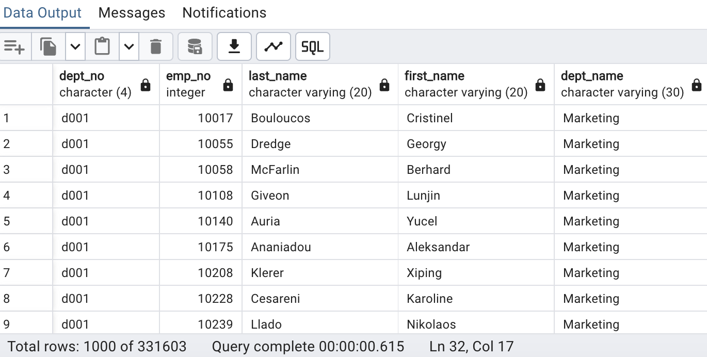
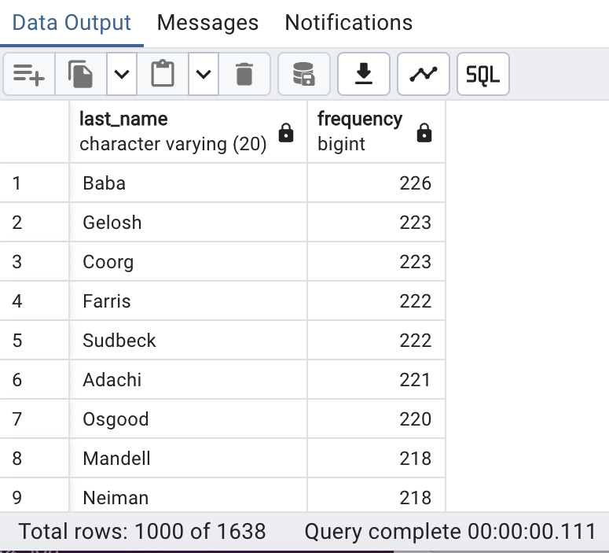

# sql-challenge
Module 9 Challenge

## Files

In the EmployeeSQL folder, I have included:

(1) An image file of the Entity_Relationship_Diagram from https://app.quickdatabasediagrams.com/#. Note that DBD has that limitation unfortunately so we cannot do composite keys (which I created in pgAdmin for the dept_emp and dept_manager tables). Also, since there are some employees that are part of more than one department and it is possible that one employee is a manager of more than one department, I made the emp_no in the dept_emp and dept_manager tables many to one relationshps with the emp_no in the employees table.

(2) A pdf of the [Entity_Relationship_Diagram_Documentation.pdf](EmployeeSQL/Entity_Relationship_Diagram_Documentation.pdf) from https://app.quickdatabasediagrams.com/#.

(3) A [Data_Engineering.sql](EmployeeSQL/Data_Engineering.sql) file of my table schemata. Used the PostgreSQL output from https://app.quickdatabasediagrams.com/#/ as a starter for my Data_Engineering.sql.

(4) A [Data_Analysis.sql](EmployeeSQL/Data_Analysis.sql) file of my queries. 

## Example Output

Below are image clips of the ouput from the first 9 or so rows of each query of the Data Analysis. 

Query 1: List the employee number, last name, first name, sex, and salary of each employee.

Query 2: List the first name, last name, and hire date for the employees who were hired in 1986.

Query 3: List the manager of each department along with their department number, department name, employee number, last name, and first name.

Query 4: List the department number for each employee along with that employee’s employee number, last name, first name, and department name.

Query 5: List first name, last name, and sex of each employee whose first name is Hercules and whose last name begins with the letter B.

Query 6: List each employee in the Sales department, including their employee number, last name, and first name.

Query 7: List each employee in the Sales and Development departments, including their employee number, last name, first name, and department name.

Query 8: List the frequency counts, in descending order, of all the employee last names (that is, how many employees share each last name).

## Note on Primary and Composite Keys

The challenge description requested that we make primary keys for all of the tables. I checked that the primary keys were all unique in the respective tables. The code for this is the [checkunique.ipynb](data/checkunique.ipynb) notebook file in the data folder. This allowed me to discover that there emp_no in the dept_emp table is repeated (i.e. some employees in more than one department) so this table requires a composite key using both emp_no and dept_no for a primary key. Although the dept_manager table did not have any repeated emp_no and emp_no could be made the primary key, I figure it is possible to have one employee be a manager for more than one department, so I created a composite key with dept_no and emp_no for this table as well.

## Note on External Resources

For this challenge, I just used techniques learned in class. I did not find myself using coding snippits from any other source.
